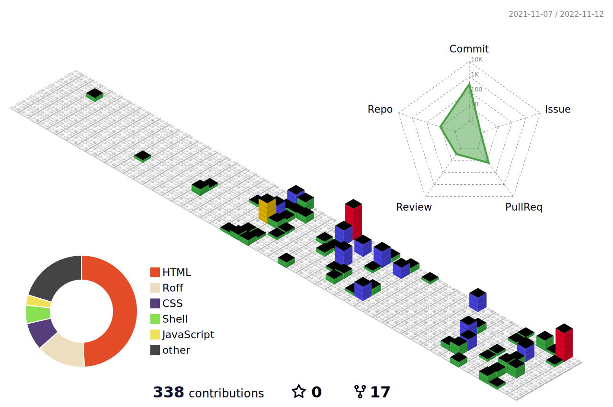

### Hi there 👋

- 📫 How to reach me: hello@vkvbit.me
- 🔗 My Portfolio: https://vkvbit.github.io https://vkvbit.me https://vaibhavkumar.rf.gd
- ⚡ Fun fact: Most rare and expensive thing on EARTH is diamond. But in UNIVERSE, it is TREES.

### Languages I am good at:

<code></code>
<code></code>
<code></code>
<code></code>
<code></code>
<code></code>

### Environments I work with:

<code></code>
<code></code>
<code></code>
<code></code>
<code></code>

### My GitHub profile stats:

### My GitHub trophies:

### My GitHub Summary:

### My GitHub contribution stats:

